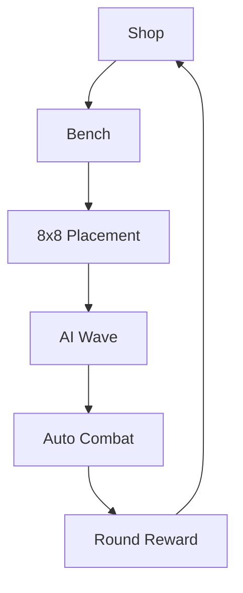

# Implementation Plan

## MVP Goal

Build a playable local single-player auto battler before adding Firebase, ads SDKs, store packaging, or AppsInToss wrapper work.

## First Playable Scope

## Guardrails

- Keep board dimensions configurable.
- Keep early turns light: round 1 starts at 4 owned units and 2 deployed units, then grows over time.
- Keep AI fair in the MVP: AI starts with the same deployed unit count as the player.
- End every combat with an explicit wrap-up before allowing the next turn.
- Show selected-unit details in prep so players can understand role, range, stats, skill, and tactical trait.
- Keep gameplay data in dictionaries until the rules stabilize.
- Do not add Firebase SDK calls inside gameplay scripts.
- Rewarded ads are represented by a mock button until platform adapters are introduced.
- Procedural unit drawings are temporary readability assets, not final sprite sheets.
- Combat pacing is intentionally readable before it is fast. Tune `COMBAT_TICK_SECONDS`, `ATTACK_ANIM_MS`, `HIT_ANIM_MS`, and `STEP_ANIM_MS` in `godot/scripts/main.gd`.
- Unit motion is data-driven through `anim_kind`, `anim_dx`, and `anim_dy`, then rendered by `godot/scripts/unit_piece.gd`.

## Next After This Slice

- Add deterministic gameplay tests for AI wave generation.
- Split rules into data/resources once the first loop feels stable.
- Generate rough sprite sheets for the 8 starter units.
- Add Android export preset after mobile layout is verified.
